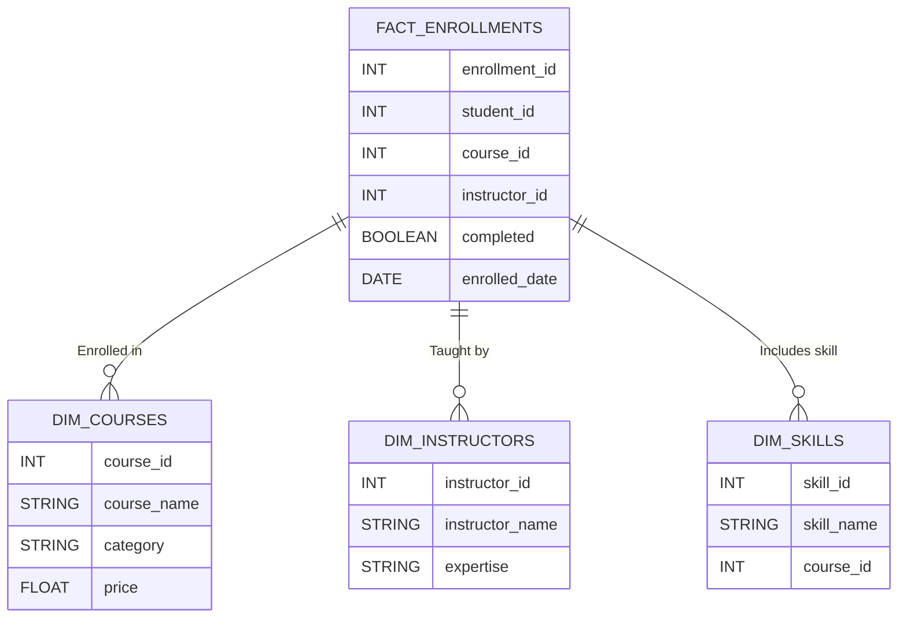

# 📚 Data Warehousing for an Online Learning Platform

## 📌 **Project Overview**  
This **Online Learning Analytics Data Warehouse** is designed to **track student progress, analyze enrollments, and monitor instructor performance** using real-time data processing and cloud technologies.  

With this data warehouse, educators and decision-makers can gain **deep insights** into course completion rates, student engagement, and enrollment trends to **enhance the e-learning experience.**  

---

## 🏢 **Architecture Overview**  

🔹 **Data Sources:** Student enrollments, course completion logs, and more (CSV files)  
🔹 **Storage:** Amazon S3  
🔹 **Ingestion:** Snowpipe with auto-ingest  
🔹 **Data Warehouse:** Snowflake  
🔹 **Transformation:** Apache Spark  
🔹 **Orchestration:** Apache Airflow  
🔹 **Visualization:** Power BI  

### **📊 Data Flow**  

---

## 🎯 **Key Features**  

👉 **Real-time Data Ingestion** – Automated Snowpipe triggers upon new file uploads  
👉 **Optimized Data Modeling** – Implemented **Star Schema** for fast and efficient queries  
👉 **Advanced ETL Pipeline** – Built using **spark** for transformations and **Apache Airflow** for automation  
👉 **Interactive Power BI Dashboard** – Visual insights on **course completion rates, enrollments, and student performance**  

---

## 🌍 **Schema Design**  

The data warehouse follows a **Star Schema** with the following tables:  

### **📂 Dimension Tables**  
- **DIM_COURSES:** Course details  
- **DIM_INSTRUCTORS:** Instructor information  
- **DIM_SKILLS:** Course-related skills  

### **📂 Fact Table**  
- **FACT_ENROLLMENTS:** Contains enrollment transactions, student progress, and completion status  

**Schema Diagram:**  

---

## 🔍 **Dashboard Insights**  

### **📈 Course Completion Rate**  
**Definition:** Percentage of students who completed a course.  
📊 **Chart Type:** Pie Chart  
📌 **Fields:**  
- **Category:** Course Name  
- **Values:** COUNT(Completed = True)

### **📀 Enrollment Trends**  
**Definition:** Track the number of enrollments over time.  
📊 **Chart Type:** Line Chart  
📌 **Fields:**  
- **X-Axis:** Enrollment Date  
- **Y-Axis:** COUNT(Student ID)
  

### **🏅 Student Performance Analysis**  
**Definition:** Analyzing student ratings and performance.  
📊 **Chart Type:** Bar Chart  
📌 **Fields:**  
- **X-Axis:** Student Name  
- **Y-Axis:** Average Rating
  

---

## 🔧 **Automation with Apache Airflow**

Apache Airflow orchestrates the **entire ETL workflow**, ensuring seamless execution of each step in the pipeline:

🔹 **DAG Definition:** Defines the workflow for data ingestion, transformation, and loading.  
🔹 **Task Dependencies:** Ensures proper execution order (e.g., processing before upload).  
🔹 **Automated Scheduling:** Runs ETL tasks at scheduled intervals (e.g., daily).  
🔹 **Monitoring & Logging:** Tracks task execution and errors via the Airflow UI.  

---

## 👋 **Contributing**  

We welcome contributions! Follow these steps:  
1️⃣ Fork the repo  
2️⃣ Create a feature branch  
3️⃣ Commit changes  
4️⃣ Open a pull request  

---

## 📩 **Contact & Connect**  

**👤 Umair**  
📧 [Email](mailto:umairnawaz7228@gmail.com)  
👉 [LinkedIn](https://www.linkedin.com/in/umairnawaz7228/)  
🌐 [GitHub](https://github.com/umair7228/)  

🌟 **If you found this project useful, don't forget to ⭐ the repo!**
